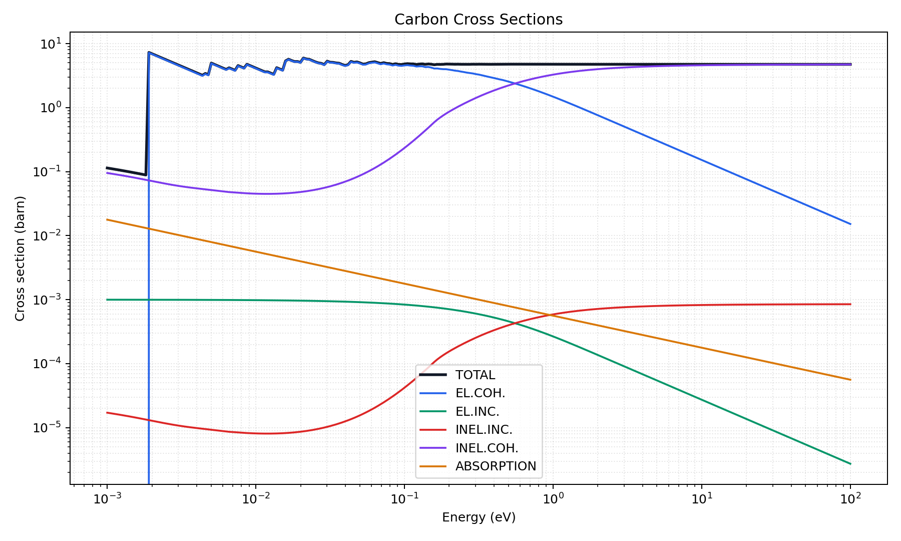

# CRIPO

Python version of CRIPO (CRYstalline and POlicrystalline, in spanish) neutron cross section calculator code documented in

Kropff, F., and J. R. Granada. "CRIPO. Program for total cross section calculation of polycrystalline materials." Centro Atómico Bariloche, CNEA, Argentina (1975).

The original Fortran code has been translated to Python and interpolation features have been updated to use `scipy` functions. 

To install

```bash
python3 -m pip install -e .
```

The usage is as follows,

```python
from cripo import CripoModel, CrystalStructure, UnitCell

model = CripoModel(
    name = "Carbon",
    sigma_incoherent=0.001,
    b_coherent_fm = 6.646,
    sigma_thermal = 0.00353,
    debye_temperature = 1860.0,
    temperature = 293.6,
    cell_parameter_a_angstrom=2.46,
    cell_parameter_c_angstrom=6.70,
    atomic_mass_amu=12.0,
    crystal_type=CrystalStructure.GRAPHITE,
    lowest_lethargy_exponent=-3,
    highest_lethargy_exponent=2,
    points_per_lethargy_decade=50,
    electrons_z=6,
    unit_cell=UnitCell(a_angstrom=2.46, c_angstrom=6.70),
)

# get data
df_carbon = model.get_cross_section_data()

# added plotting functionality
fig = model.plot_xs("imgs/carbon_xs.png")
```

The integer `crystal_type` codes are still accepted, but the package now also
exposes `CrystalStructure` and `UnitCell`. This is the first step toward a more
general crystal-description API that can support additional crystalline
structures in future versions.



A special thanks to R. Granada for the permission to make a Python version of the original CRIPO code available.
